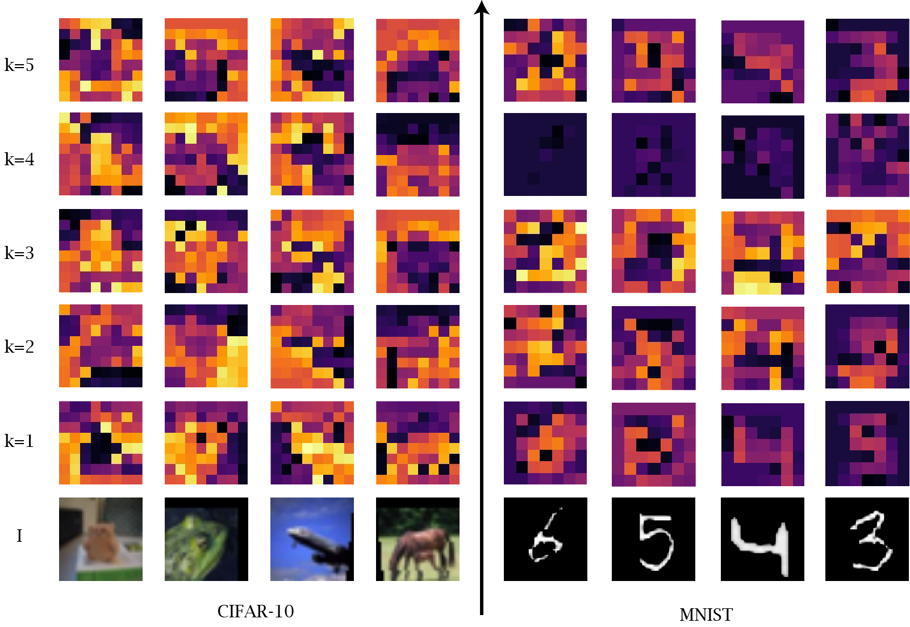

# Agglomerator++
Official repository code for "Agglomerator++: interpretable part-whole hierarchies and latent space representations in neural networks"

## Datasets
This repository uses:
- [MNIST](https://paperswithcode.com/dataset/mnist)
- [Fashion-MNIST](https://paperswithcode.com/dataset/fashion-mnist)
- [CIFAR-10](https://paperswithcode.com/dataset/cifar-10)
- [CIFAR-100](https://paperswithcode.com/dataset/cifar-100)
- [smallNORB](https://paperswithcode.com/dataset/smallnorb)
